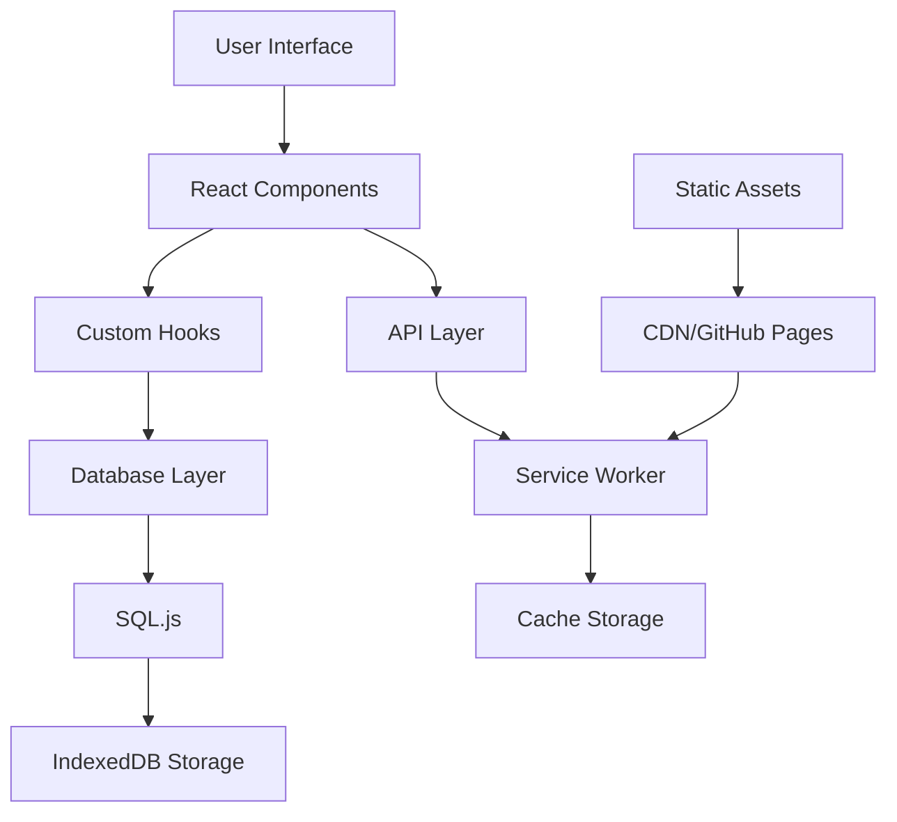

# Architecture Overview

## 📐 System Architecture

Forum Scraper Frontend is built as a modern, performant Progressive Web Application using Next.js 15 with a focus on scalability, maintainability, and user experience.

## 🏗️ Technical Stack

### Core Technologies

- **Framework**: Next.js 15 (App Router)
- **Language**: TypeScript 5.x
- **Styling**: Tailwind CSS 3.x
- **State Management**: React Context + Custom Hooks
- **Database**: SQL.js (In-browser SQLite)
- **Testing**: Vitest + Playwright

## 📁 Project Structure

```
fscrape-frontend/
├── app/                      # Next.js App Router
│   ├── layout.tsx           # Root layout
│   ├── page.tsx            # Home page
│   ├── dashboard/          # Dashboard routes
│   ├── posts/              # Posts explorer
│   ├── analytics/          # Analytics views
│   └── compare/            # Comparison tools
│
├── components/              # React Components
│   ├── ui/                 # Base UI components (shadcn/ui)
│   ├── charts/             # Chart components
│   ├── tables/             # Table components
│   ├── dashboard/          # Dashboard widgets
│   ├── analytics/          # Analytics components
│   ├── compare/            # Comparison components
│   └── pwa/                # PWA-specific components
│
├── lib/                     # Utilities & Logic
│   ├── db/                 # Database utilities
│   ├── hooks/              # Custom React hooks
│   ├── utils/              # Helper functions
│   ├── pwa/                # PWA utilities
│   └── types/              # TypeScript types
│
├── public/                  # Static Assets
│   ├── sw.js               # Service Worker
│   ├── manifest.json       # Web App Manifest
│   └── icons/              # PWA icons
│
├── styles/                  # Global Styles
│   └── globals.css         # Global CSS
│
├── __tests__/              # Unit Tests
├── e2e/                    # E2E Tests
└── scripts/                # Build & Utility Scripts
```

## 🔄 Data Flow



## 🎯 Key Design Patterns

### 1. Component Architecture

```typescript
// Atomic Design Pattern
components/
├── ui/          # Atoms (buttons, inputs)
├── blocks/      # Molecules (cards, forms)
├── sections/    # Organisms (header, sidebar)
└── layouts/     # Templates (page layouts)
```

### 2. State Management

```typescript
// Context + Hooks Pattern
const useDatabase = () => {
  const [db, setDb] = useState<Database | null>(null);
  const [loading, setLoading] = useState(true);
  
  // Database initialization and management
  return { db, loading, error };
};
```

### 3. Data Fetching

```typescript
// Server Components for Static Data
async function PostsPage() {
  const posts = await fetchPosts(); // Server-side
  return <PostsTable posts={posts} />;
}

// Client Hooks for Dynamic Data
function useRealtimeData() {
  const [data, setData] = useState();
  useEffect(() => {
    // Client-side fetching
  }, []);
  return data;
}
```

## 🚀 Performance Optimizations

### Code Splitting

- **Route-based splitting**: Automatic with Next.js App Router
- **Component lazy loading**: Dynamic imports for heavy components
- **Library chunking**: Separate vendor bundles

### Caching Strategy

```javascript
// Service Worker Caching
const CACHE_STRATEGIES = {
  CACHE_FIRST: [images, fonts, styles],
  NETWORK_FIRST: [api, json],
  STALE_WHILE_REVALIDATE: [js, static],
};
```

### Virtualization

- **Large lists**: Using virtual scrolling
- **Heavy tables**: Windowing techniques
- **Image optimization**: Next.js Image component

## 📊 Database Architecture

### SQL.js Integration

```typescript
interface DatabaseSchema {
  posts: {
    id: number;
    title: string;
    content: string;
    author: string;
    created_at: string;
    // ...
  };
  
  analytics: {
    id: number;
    metric: string;
    value: number;
    timestamp: string;
    // ...
  };
}
```

### Offline Support

- **Initial Load**: Download database.db
- **Caching**: Store in IndexedDB
- **Updates**: Background sync when online
- **Fallback**: Cached data when offline

## 🔐 Security Architecture

### Content Security Policy

```javascript
const securityHeaders = {
  'Content-Security-Policy': "default-src 'self'",
  'X-Frame-Options': 'DENY',
  'X-Content-Type-Options': 'nosniff',
  'Referrer-Policy': 'strict-origin-when-cross-origin',
};
```

### Data Protection

- **Input Sanitization**: XSS prevention
- **SQL Injection**: Parameterized queries
- **HTTPS Only**: Enforced in production
- **Secure Headers**: CSP, HSTS, etc.

## 🎨 UI/UX Architecture

### Design System

```css
/* CSS Variables for Theming */
:root {
  --primary: theme colors
  --background: adaptive colors
  --foreground: text colors
}
```

### Responsive Design

- **Mobile First**: Base styles for mobile
- **Breakpoints**: sm, md, lg, xl, 2xl
- **Fluid Typography**: Clamp() for scaling
- **Container Queries**: Component-level responsiveness

### Accessibility

- **ARIA Labels**: Proper labeling
- **Keyboard Navigation**: Tab order, focus management
- **Screen Readers**: Semantic HTML
- **Color Contrast**: WCAG 2.1 AA compliance

## 📱 PWA Architecture

### Service Worker

```javascript
// Lifecycle Management
self.addEventListener('install', precache);
self.addEventListener('activate', cleanup);
self.addEventListener('fetch', handleRequest);
```

### Web App Manifest

```json
{
  "name": "Forum Scraper",
  "display": "standalone",
  "start_url": "/",
  "theme_color": "#000000"
}
```

### Installation Flow

1. **Detect Support**: Check for beforeinstallprompt
2. **Show Prompt**: Custom install UI
3. **Handle Install**: Track analytics
4. **Post-Install**: Update UI state

## 🧪 Testing Architecture

### Testing Pyramid

```
         /\
        /E2E\       (5%)
       /------\
      /  Integ  \   (15%)
     /------------\
    /   Unit Tests  \ (80%)
   ------------------
```

### Test Structure

```typescript
// Unit Test Example
describe('Component', () => {
  it('should render', () => {});
  it('should handle interaction', () => {});
});

// E2E Test Example
test('user flow', async ({ page }) => {
  await page.goto('/');
  await page.click('button');
  await expect(page).toHaveURL('/dashboard');
});
```

## 🚢 Deployment Architecture

### Build Pipeline

```yaml
build:
  - Install dependencies
  - Run tests
  - Type checking
  - Build static export
  - Optimize assets
  - Deploy to GitHub Pages
```

### Static Export

- **Output**: Static HTML/CSS/JS
- **Routing**: File-based with trailing slashes
- **Assets**: Optimized and cached
- **Database**: Bundled as static file

## 📈 Monitoring & Analytics

### Performance Monitoring

```typescript
// Web Vitals Tracking
export function reportWebVitals(metric) {
  // Send to analytics
  console.log(metric);
}
```

### Error Tracking

- **Client Errors**: Error boundaries
- **Network Errors**: Service worker fallbacks
- **Build Errors**: CI/CD checks

## 🔄 Future Considerations

### Scalability

- **Micro-frontends**: Module federation
- **Edge Functions**: For dynamic content
- **CDN Distribution**: Global availability
- **Database Sharding**: For large datasets

### Enhancements

- **Real-time Updates**: WebSocket integration
- **Advanced Analytics**: ML-powered insights
- **Collaboration**: Multi-user features
- **API Gateway**: Backend services integration

## 📚 References

- [Next.js Documentation](https://nextjs.org/docs)
- [React Architecture Patterns](https://reactpatterns.com)
- [PWA Best Practices](https://web.dev/pwa)
- [Web Vitals](https://web.dev/vitals)