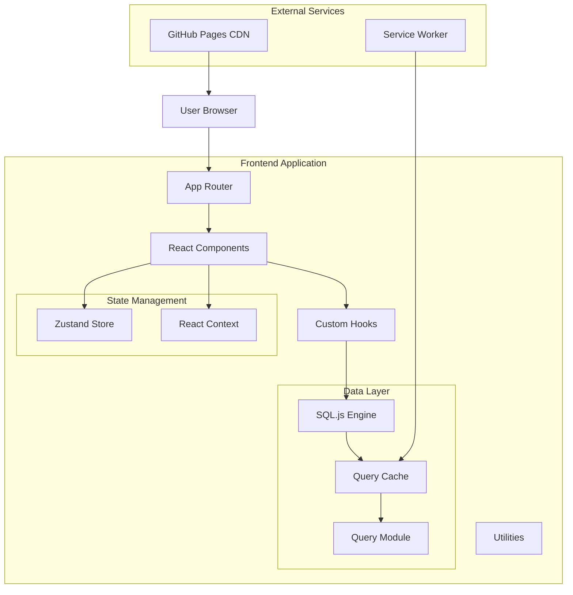

# Architecture Overview

## Table of Contents
- [Project Structure](#project-structure)
- [Technology Stack](#technology-stack)
- [Application Architecture](#application-architecture)
- [Data Flow](#data-flow)
- [Component Architecture](#component-architecture)
- [Database Layer](#database-layer)
- [Performance Optimizations](#performance-optimizations)
- [Security Architecture](#security-architecture)
- [Deployment Architecture](#deployment-architecture)

## Project Structure

```
fscrape-frontend/
├── app/                      # Next.js App Router pages
│   ├── layout.tsx           # Root layout with providers
│   ├── page.tsx             # Dashboard/home page
│   ├── analytics/           # Analytics page and components
│   ├── compare/             # Comparison tools page
│   └── posts/               # Posts explorer page
├── components/              # React components
│   ├── analytics/           # Analytics-specific components
│   ├── charts/              # Chart components (Recharts)
│   ├── compare/             # Comparison components
│   ├── dashboard/           # Dashboard components
│   ├── tables/              # Table components
│   └── ui/                  # Base UI components (shadcn/ui)
├── lib/                     # Core utilities and logic
│   ├── analytics/           # Analytics utilities
│   ├── db/                  # Database layer
│   ├── hooks/               # Custom React hooks
│   ├── pwa/                 # PWA service worker
│   └── utils/               # Utility functions
├── public/                  # Static assets
│   ├── data/                # SQLite database files
│   └── icons/               # PWA icons
├── scripts/                 # Build and utility scripts
├── __tests__/               # Unit tests (Vitest)
└── e2e/                     # E2E tests (Playwright)
```

## Technology Stack

### Core Technologies
- **Framework**: Next.js 15 with App Router
- **Language**: TypeScript 5.9
- **Styling**: Tailwind CSS 4.1
- **State Management**: Zustand 5.0
- **Database**: SQL.js (in-browser SQLite)

### UI Libraries
- **Component Library**: Radix UI + shadcn/ui
- **Charts**: Recharts 3.2
- **Icons**: Lucide React
- **Animations**: Framer Motion 12
- **Virtualization**: React Window + TanStack Virtual

### Development Tools
- **Testing**: Vitest + React Testing Library + Playwright
- **Linting**: ESLint + Prettier
- **Build**: Turbopack (development) / Webpack (production)
- **CI/CD**: GitHub Actions

## Application Architecture

### Architectural Patterns



### Key Design Principles
1. **Static First**: Fully static site generation for optimal performance
2. **Client-Side Database**: SQL.js for in-browser data processing
3. **Progressive Enhancement**: Core functionality works without JavaScript
4. **Mobile First**: Responsive design starting from mobile breakpoints
5. **Performance Optimized**: Code splitting, lazy loading, virtualization

## Data Flow

### Data Loading Process
```typescript
// 1. Database initialization
const db = await initSqlJs({
  locateFile: file => `/sql-js/${file}`
});

// 2. Load database file
const buffer = await fetch('/data/forum.db').then(r => r.arrayBuffer());
const database = new db.Database(new Uint8Array(buffer));

// 3. Query execution with caching
const posts = await cachedQuery(
  'SELECT * FROM posts WHERE platform = ?',
  ['reddit'],
  { ttl: 60000 } // 1 minute cache
);

// 4. State update
useStore.setState({ posts });
```

### Caching Strategy
- **Query Cache**: 60-second TTL for database queries
- **Component Cache**: React.memo for expensive components
- **Browser Cache**: Service Worker for static assets
- **CDN Cache**: GitHub Pages edge caching

## Component Architecture

### Component Hierarchy
```
App
├── Layout (Providers, Theme, Navigation)
│   ├── Dashboard
│   │   ├── StatCards
│   │   ├── ChartGrid
│   │   └── RecentPosts
│   ├── Analytics
│   │   ├── TrendCharts
│   │   ├── HeatmapCalendar
│   │   └── TopAuthors
│   ├── Posts
│   │   ├── PostsTable (Virtualized)
│   │   ├── FilterPanel
│   │   └── SearchBar
│   └── Compare
│       ├── PlatformSelector
│       ├── ComparisonCharts
│       └── MetricsGrid
```

### Component Design Patterns
- **Compound Components**: Complex UI with flexible composition
- **Render Props**: Sharing logic between components
- **Custom Hooks**: Encapsulating business logic
- **Lazy Loading**: Dynamic imports for code splitting

## Database Layer

### Schema Design
```sql
-- Posts table
CREATE TABLE posts (
  id TEXT PRIMARY KEY,
  platform TEXT NOT NULL,
  title TEXT NOT NULL,
  author TEXT,
  content TEXT,
  url TEXT,
  score INTEGER DEFAULT 0,
  comments INTEGER DEFAULT 0,
  created_at DATETIME,
  metadata JSON
);

-- Indexes for performance
CREATE INDEX idx_posts_platform ON posts(platform);
CREATE INDEX idx_posts_created_at ON posts(created_at);
CREATE INDEX idx_posts_score ON posts(score DESC);
CREATE INDEX idx_posts_author ON posts(author);

-- Metadata table
CREATE TABLE metadata (
  key TEXT PRIMARY KEY,
  value TEXT,
  updated_at DATETIME DEFAULT CURRENT_TIMESTAMP
);
```

### Query Optimization
- **Index Usage**: Covering indexes for common queries
- **Query Planning**: EXPLAIN QUERY PLAN analysis
- **Batch Operations**: Bulk inserts and updates
- **Connection Pooling**: Reusing database connections

## Performance Optimizations

### Build-Time Optimizations
- **Static Generation**: Pre-rendering at build time
- **Image Optimization**: Next.js Image component
- **Tree Shaking**: Removing unused code
- **Minification**: Terser for JavaScript, CSS minification

### Runtime Optimizations
- **Code Splitting**: Route-based and component-based
- **Lazy Loading**: Dynamic imports with React.lazy
- **Virtualization**: Large lists with react-window
- **Web Workers**: Offloading heavy computations

### Metrics Targets
- **Lighthouse Score**: 95+ across all metrics
- **First Contentful Paint**: < 1.5s
- **Time to Interactive**: < 3.5s
- **Cumulative Layout Shift**: < 0.1

## Security Architecture

### Security Measures
- **Content Security Policy**: Restrictive CSP headers
- **Input Validation**: Schema validation for all inputs
- **XSS Prevention**: React's built-in escaping
- **SQL Injection Prevention**: Parameterized queries
- **HTTPS Only**: Enforced via GitHub Pages

### Data Protection
```typescript
// Input sanitization example
export function sanitizeInput(input: string): string {
  return input
    .replace(/[<>]/g, '') // Remove HTML tags
    .trim()
    .slice(0, MAX_INPUT_LENGTH);
}

// SQL parameterization
const safeQuery = db.prepare(
  'SELECT * FROM posts WHERE id = ?'
);
safeQuery.bind([sanitizedId]);
```

## Deployment Architecture

### GitHub Pages Deployment
```yaml
# .github/workflows/deploy.yml
- Build static site with Next.js
- Optimize assets (images, fonts)
- Generate service worker
- Deploy to gh-pages branch
- Invalidate CDN cache
```

### Environment Configuration
```bash
# Production
NODE_ENV=production
NEXT_PUBLIC_BASE_PATH=/fscrape-frontend
NEXT_PUBLIC_API_URL=https://api.example.com

# Development
NODE_ENV=development
NEXT_PUBLIC_BASE_PATH=
NEXT_PUBLIC_API_URL=http://localhost:3000
```

### Monitoring and Analytics
- **Error Tracking**: Console error boundaries
- **Performance Monitoring**: Web Vitals API
- **User Analytics**: Privacy-focused analytics
- **Uptime Monitoring**: GitHub Actions scheduled checks

## Development Workflow

### Local Development
```bash
# Install dependencies
npm install

# Start development server
npm run dev

# Run tests in watch mode
npm run test:watch
```

### Code Quality Pipeline
1. **Pre-commit**: Linting and formatting
2. **Pre-push**: Type checking and tests
3. **Pull Request**: Full CI pipeline
4. **Merge**: Automatic deployment

### Debugging Tools
- React DevTools
- Redux DevTools (for Zustand)
- Chrome DevTools Performance tab
- Lighthouse CI integration

## Future Considerations

### Scalability Plans
- **API Backend**: Migrate from static DB to API
- **Real-time Updates**: WebSocket integration
- **Internationalization**: i18n support
- **Multi-tenancy**: Organization support

### Technical Debt
- Migrate from Pages to App Router (completed)
- Update to React 19 (completed)
- Implement React Server Components
- Add E2E test coverage for all flows

## References

- [Next.js Documentation](https://nextjs.org/docs)
- [React Architecture Patterns](https://react.dev/learn)
- [SQL.js Documentation](https://sql.js.org)
- [Web Performance Best Practices](https://web.dev/performance)